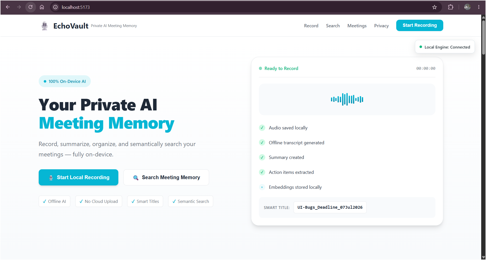
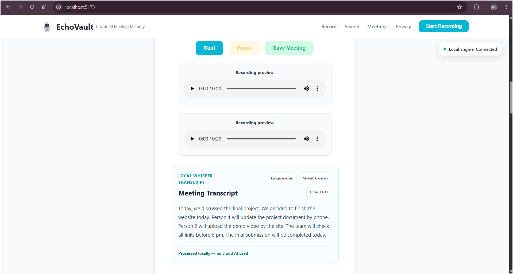
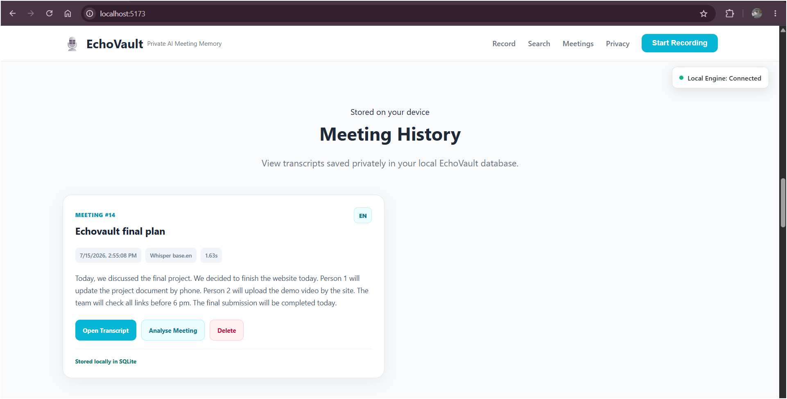
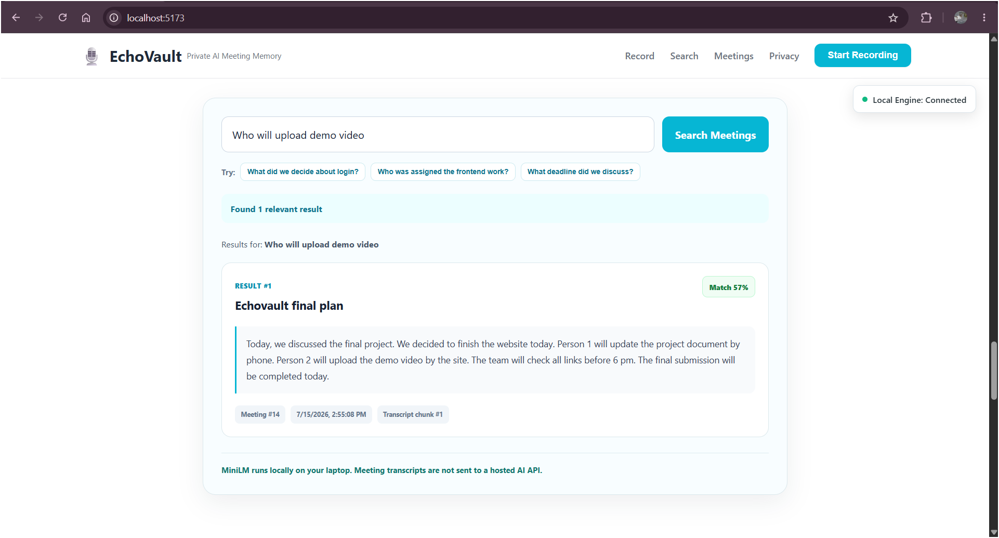
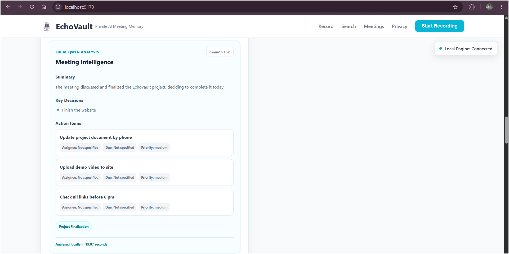

# 🎙️ EchoVault

> **Your private, on-device AI meeting memory.**

EchoVault is a privacy-focused meeting assistant that records meetings, converts speech into text, stores transcripts locally, performs meaning-based search, and generates meeting summaries using AI models running on the user's own computer.

The project was built for **OSDHack 2026**.

---

## 📌 Project Status

**Functional Hackathon Prototype**

The following features are currently implemented and tested:

- Browser-based microphone recording
- Pause, resume, stop and save controls
- Local audio-file storage
- Local speech-to-text transcription
- Meeting history using SQLite
- Natural-language semantic search
- AI-generated meeting summaries
- Key-decision extraction
- Action-item extraction
- Topic extraction
- Meeting and audio deletion
- Responsive desktop and mobile interface
- Local engine connection indicator

---

## 🚨 Problem Statement

People attend many college discussions, project reviews, hackathons, interviews and professional meetings.

After a few days, they may forget:

- What was discussed
- What decisions were made
- Who was assigned a particular task
- Whether a deadline was mentioned
- In which meeting a specific topic was discussed

Many existing meeting assistants depend on cloud-based AI services. This can create concerns such as:

- Confidential recordings being uploaded to external servers
- Dependence on a continuous internet connection
- Privacy risks involving meeting transcripts
- Recurring subscription costs
- Search limited mainly to exact keywords
- Recordings stored with unclear or generic names

---

## 💡 Our Solution

EchoVault provides a private meeting-memory system in which the main AI functionality runs locally.

It allows users to:

1. Record a meeting directly from the browser
2. Save the audio file on their own computer
3. Transcribe the recording using local Whisper
4. Save the transcript in a local SQLite database
5. Search old meetings using natural-language questions
6. Generate summaries, decisions, topics and action items locally
7. Delete both the stored meeting and its associated recording

After the required models have been downloaded, EchoVault does not require a hosted AI API for its main features.

---

## ✨ Main Features

### 🎤 Local Meeting Recording

- Records microphone audio from the browser
- Provides pause, resume and stop controls
- Displays the recording duration
- Allows the user to enter a meeting title
- Uploads the completed recording only to the local FastAPI backend

### 📝 Local Speech-to-Text

- Uses Faster-Whisper
- Runs on the local CPU
- Uses the lightweight Whisper Tiny model
- Converts the saved recording into a transcript
- Does not send the audio to an online transcription API

### 🗃️ Local Meeting Storage

- Stores meeting information in SQLite
- Saves the title, transcript, audio filename and creation time
- Stores generated summaries and extracted information
- Retains meeting history after restarting the application

### 🔍 Semantic Meeting Search

- Uses sentence embeddings rather than only exact keywords
- Allows natural-language searches
- Finds transcript sections with similar meaning
- Displays the matching meeting and relevant transcript content

Example searches:

```text
Who was assigned the README?
```

```text
What did we decide about the backend?
```

```text
Which meeting discussed the final submission?
```

### 🧠 Local AI Meeting Analysis

EchoVault uses a local Qwen model through Ollama to generate:

- Meeting summary
- Key decisions
- Action items
- Responsible person, when mentioned
- Deadline, when mentioned
- Important topics

### 🗑️ Meeting Deletion

- Deletes the meeting from SQLite
- Deletes the associated local recording
- Removes the meeting from the user interface

### 📱 Responsive Interface

- Desktop-friendly layout
- Mobile-friendly navigation
- Responsive meeting cards
- Smooth scrolling to the recording section
- Clear local-engine connection status

---

## 🔐 Privacy-First Design

EchoVault is designed around local processing.

| Data or Process | Storage or Execution Location |
|---|---|
| Microphone recording | User's browser and local backend |
| Audio file | Local `backend/uploads` folder |
| Transcript | Local SQLite database |
| Speech-to-text | Local Faster-Whisper model |
| Semantic embeddings | Local sentence-transformer model |
| Meeting analysis | Local Qwen model through Ollama |
| Meeting history | Local SQLite database |

EchoVault does not require recordings or transcripts to be uploaded to a hosted AI service.

Internet access is required during initial setup for:

- Installing Python packages
- Installing frontend dependencies
- Downloading the Whisper model
- Downloading the sentence-transformer model
- Downloading the Ollama model

After the models and dependencies are available locally, the main AI inference workflow runs on the user's computer.

> Users should obtain the consent of meeting participants before recording or transcribing a conversation.

---

## 🏗️ System Architecture

```text
┌─────────────────────────────────────┐
│            User's Browser           │
│                                     │
│  React Interface + MediaRecorder    │
└──────────────────┬──────────────────┘
                   │
                   │ Local HTTP requests
                   ▼
┌─────────────────────────────────────┐
│        FastAPI Local Backend        │
│          127.0.0.1:8000             │
├─────────────────────────────────────┤
│                                     │
│  Faster-Whisper                     │
│  └── Local speech-to-text           │
│                                     │
│  all-MiniLM-L6-v2                   │
│  └── Local semantic search          │
│                                     │
│  Ollama + Qwen2.5 1.5B              │
│  └── Local meeting analysis         │
│                                     │
│  SQLite                             │
│  └── Local meeting storage          │
│                                     │
│  Uploads Folder                     │
│  └── Local audio storage            │
│                                     │
└─────────────────────────────────────┘
```

---

## 🔄 Application Workflow

```text
Record Meeting
      ↓
Save Audio Locally
      ↓
Transcribe with Faster-Whisper
      ↓
Store Meeting and Transcript in SQLite
      ↓
View Meeting in Meeting History
      ↓
Search Transcript with MiniLM Embeddings
      ↓
Analyse Transcript with Local Qwen
      ↓
Display Summary, Decisions, Tasks and Topics
```

---

## 🧰 Technology Stack

### Frontend

- React
- Vite
- JavaScript
- CSS
- Browser MediaRecorder API
- Fetch API

### Backend

- Python
- FastAPI
- Uvicorn
- Pydantic
- HTTPX
- SQLite
- Python Multipart

### Local AI

- Faster-Whisper
- CTranslate2
- Sentence Transformers
- all-MiniLM-L6-v2
- Ollama
- Qwen2.5 1.5B
- NumPy

### Development Tools

- Visual Studio Code
- Git
- GitHub
- Chrome Developer Tools

---

## 🤖 Local AI Model Information

| Purpose | Model | Source | Licence | Format | Approximate Size | Runtime |
|---|---|---|---|---|---:|---|
| Speech-to-text | Whisper Tiny | OpenAI Whisper conversion by Systran | MIT | CTranslate2 | 78.2 MB | Faster-Whisper on CPU |
| Semantic search | all-MiniLM-L6-v2 | Sentence Transformers | Apache-2.0 | PyTorch / Safetensors | 90.9 MB standard weights | Sentence Transformers on CPU |
| Meeting analysis | Qwen2.5 1.5B | Qwen through Ollama | Apache-2.0 | Q4_K_M quantized Ollama model | 986 MB | Ollama local runtime |

### Model Usage

#### Whisper Tiny

Used to convert recorded meeting audio into text.

```python
WhisperModel(
    "tiny",
    device="cpu",
    compute_type="int8"
)
```

#### all-MiniLM-L6-v2

Used to convert transcript chunks and search queries into embeddings for meaning-based search.

```python
SentenceTransformer("all-MiniLM-L6-v2")
```

#### Qwen2.5 1.5B

Used through the local Ollama API to generate structured meeting analysis.

```text
qwen2.5:1.5b
```

---

## 📁 Project Structure

All the following folders and files are directly inside the main `EchoVault` folder.

```text
EchoVault/
│
├── backend/
│   ├── main.py
│   ├── database.py
│   ├── requirements.txt
│   ├── uploads/
│   └── echovault.db
│
├── project/
│   ├── public/
│   ├── src/
│   │   ├── services/
│   │   │   └── api.js
│   │   ├── App.jsx
│   │   ├── App.css
│   │   └── main.jsx
│   ├── package.json
│   ├── package-lock.json
│   └── vite.config.js
│
├── screenshots/
│
├── .gitignore
├── LICENSE
└── README.md
```

The following local or generated items are excluded from GitHub:

- Python virtual environment
- Node modules
- Production build files
- Local SQLite database
- Uploaded recordings
- Python cache files
- Environment files

---

## ✅ Requirements

Install the following before running EchoVault:

- Git
- Python
- Node.js and npm
- Ollama
- Google Chrome or another Chromium-based browser

Python 3.12 is recommended.

---

## 🚀 Installation and Setup

### 1. Clone the Repository

Open PowerShell:

```powershell
git clone <YOUR_GITHUB_REPOSITORY_URL>
cd EchoVault
```

Replace `<YOUR_GITHUB_REPOSITORY_URL>` with the public GitHub repository URL.

---

### 2. Set Up the Backend

Move into the backend folder:

```powershell
cd backend
```

Create a Python virtual environment:

```powershell
python -m venv .venv
```

Activate the virtual environment:

```powershell
.\.venv\Scripts\Activate.ps1
```

The terminal should now begin with:

```text
(.venv)
```

Install the backend requirements:

```powershell
python -m pip install --upgrade pip
python -m pip install -r requirements.txt
```

---

### 3. Install the Local Ollama Model

Make sure Ollama is installed and running.

Download Qwen2.5 1.5B:

```powershell
ollama pull qwen2.5:1.5b
```

Confirm that the model is installed:

```powershell
ollama list
```

The list should contain:

```text
qwen2.5:1.5b
```

---

### 4. Start the Backend

From the `backend` folder with the virtual environment activated:

```powershell
python -m uvicorn main:app --reload --host 127.0.0.1 --port 8000
```

The backend will run at:

```text
http://127.0.0.1:8000
```

FastAPI documentation will be available at:

```text
http://127.0.0.1:8000/docs
```

Keep this terminal open.

---

### 5. Set Up the Frontend

Open a second PowerShell terminal.

Move into the frontend folder:

```powershell
cd EchoVault\project
```

Install the frontend dependencies:

```powershell
npm install
```

Start the development server:

```powershell
npm run dev
```

The frontend will normally be available at:

```text
http://localhost:5173
```

Open the address shown in the terminal.

---

## ▶️ How to Use EchoVault

### Before Opening the Application

Make sure all three components are running:

1. Ollama
2. FastAPI backend
3. React frontend

### Recording a Meeting

1. Open the EchoVault frontend.
2. Confirm that the status says `Local Engine: Connected`.
3. Press `Start Recording`.
4. Allow microphone access when the browser asks.
5. Enter or confirm the meeting title.
6. Speak clearly into the microphone.
7. Pause or resume when required.
8. Press the stop button.
9. Save and transcribe the recording.
10. Wait for local transcription to finish.

The first transcription may take longer because the Whisper model must be loaded.

### Viewing Meetings

1. Scroll to the Meeting History section.
2. Locate the saved meeting.
3. Open the meeting to view its complete transcript.

### Searching Meetings

1. Open the Search section.
2. Enter a natural-language question.
3. Submit the search.
4. EchoVault will compare the query with transcript chunks.
5. The most relevant meetings and transcript content will be displayed.

### Analysing a Meeting

1. Open Meeting History.
2. Find the required meeting.
3. Press the Analyse button.
4. Wait while Qwen processes the transcript locally.
5. View the generated:
   - Summary
   - Key decisions
   - Action items
   - Topics

### Deleting a Meeting

1. Find the meeting in Meeting History.
2. Press Delete.
3. Confirm the action.
4. EchoVault will remove the database record and associated audio file.

---

## 🔌 Local API Endpoints

| Method | Endpoint | Purpose |
|---|---|---|
| `GET` | `/api/health` | Check whether the backend is running |
| `POST` | `/api/recordings/upload` | Upload a local recording |
| `POST` | `/api/recordings/{filename}/transcribe` | Transcribe a recording |
| `POST` | `/api/meetings` | Save a meeting |
| `GET` | `/api/meetings` | Retrieve all meetings |
| `GET` | `/api/meetings/{meeting_id}` | Retrieve one meeting |
| `DELETE` | `/api/meetings/{meeting_id}` | Delete a meeting and its audio |
| `POST` | `/api/search` | Perform semantic transcript search |
| `POST` | `/api/meetings/{meeting_id}/analyse` | Generate local meeting analysis |

---

## 🗄️ Local Data Storage

### SQLite Database

Meeting data is stored in:

```text
backend/echovault.db
```

The database can contain:

- Meeting ID
- Meeting title
- Transcript
- Audio filename
- Creation time
- Summary
- Key decisions
- Action items
- Topics
- Analysis model
- Analysis duration

### Audio Recordings

Audio recordings are stored in:

```text
backend/uploads/
```

Both the database and audio folder are ignored by Git to prevent private meeting data from being uploaded to GitHub.

---

## 📸 Screenshots

### Home Page



### Recording and Transcription



### Meeting History



### Meeting Search



### Meeting Analysis


---

## 🎥 Demo Video

[Watch the EchoVault Demo](https://drive.google.com/file/d/1ikbJVmipoJJmbf5tu79TULWGs2Esu7xe/view?usp=sharing)

---

## 🧪 Testing Completed

The following workflows were manually tested:

- Backend health connection
- Frontend-to-backend communication
- Microphone permission
- Recording start, pause, resume and stop
- Audio upload
- Whisper transcription
- SQLite meeting storage
- Meeting-history persistence
- Meeting opening
- Meeting deletion
- Semantic search
- Qwen analysis
- Ollama unavailable state
- Backend unavailable state
- Frontend production build
- ESLint checks
- Desktop responsiveness
- Mobile responsiveness
- Navigation-button scrolling

---

## ⚠️ Current Limitations

- Speaker identification is not implemented
- Different speakers are not separated automatically
- Transcription begins after the recording is stopped
- Transcription quality depends on microphone quality
- Background noise can reduce accuracy
- Whisper may occasionally generate incorrect words
- CPU inference can take time on lower-powered computers
- The first model execution is slower because the model must load
- Long meetings require more processing time
- The application currently focuses on local Windows usage
- There is no user-account or authentication system
- Meetings cannot currently be exported as PDF or DOCX
- Action items cannot yet be edited from the interface
- The application is a hackathon prototype and not a production security product

---

## 🔮 Future Improvements

- Speaker identification and diarization
- Live transcription during recording
- Editable meeting titles and transcripts
- Editable action items
- PDF, DOCX and text export
- Calendar integration
- Meeting tags and folders
- Search filters
- Improved multilingual transcription
- Optional meeting encryption
- Desktop application packaging
- Progressive Web App support
- GPU acceleration
- Model selection based on device capability
- Automatic meeting-title generation
- Improved long-meeting chunking
- Local retrieval-augmented question answering
- Optional password protection

---

## 🛠️ Troubleshooting

### Local Engine Shows Disconnected

Confirm that the backend terminal is running:

```powershell
python -m uvicorn main:app --reload --host 127.0.0.1 --port 8000
```

Then open:

```text
http://127.0.0.1:8000/api/health
```

Refresh the frontend after the backend starts.

---

### Ollama Analysis Is Not Working

Make sure Ollama is running.

Check the installed models:

```powershell
ollama list
```

If Qwen is missing:

```powershell
ollama pull qwen2.5:1.5b
```

Test the model:

```powershell
ollama run qwen2.5:1.5b
```

---

### PowerShell Blocks Virtual-Environment Activation

Run:

```powershell
Set-ExecutionPolicy -Scope Process -ExecutionPolicy Bypass
```

Then activate the environment:

```powershell
.\.venv\Scripts\Activate.ps1
```

---

### Python Module Not Found

Ensure the virtual environment is active and reinstall requirements:

```powershell
python -m pip install -r requirements.txt
```

---

### Microphone Is Not Working

1. Open the browser's site settings.
2. Allow microphone access for `localhost`.
3. Refresh the page.
4. Start the recording again.

---

### First Transcription or Search Is Slow

Whisper and MiniLM are downloaded and loaded during their first use.

Later requests should be faster while the models remain loaded.

---

## 🧹 Repository Privacy

The repository should not include:

- Personal meeting recordings
- Private transcripts
- SQLite database files containing meetings
- Environment secrets
- Python virtual environments
- Node modules
- Generated frontend builds
- Model-cache folders

The `.gitignore` file prevents these files from being committed.

Before every push, review the changed files using:

```powershell
git status
```

---

## 🤝 AI-Assisted Development Disclosure

AI development tools were used to assist with:

- Project planning
- Code suggestions
- Debugging
- Interface improvements
- Documentation drafting
- Error explanation

The team manually:

- Integrated the frontend and backend
- Configured the local models
- Connected the database
- Tested the complete workflow
- Reviewed the generated code
- Fixed implementation issues
- Verified the final application behaviour

The submitted repository represents the team's integrated and tested project.

---

## 👥 Contributors

- **Krishnaa A R**
- **Haasini**

---

## 🏆 Hackathon

Built for:

```text
OSDHack 2026
Open Source Developers Community
```

EchoVault follows the event's local-first AI theme by running its core transcription, semantic-search and meeting-analysis functions on the user's own device.

---

## 📄 Licence

The EchoVault source code is released under the **MIT License**.

See the `LICENSE` file in the root of the repository for the full project licence.

Third-party libraries and AI models retain their original licences:

- Whisper Tiny — MIT
- Faster-Whisper / CTranslate2 model conversion — MIT
- all-MiniLM-L6-v2 — Apache-2.0
- Qwen2.5 1.5B — Apache-2.0

---

## ⭐ Final Note

EchoVault demonstrates that a useful AI meeting assistant can operate locally without requiring users to upload confidential recordings and transcripts to a hosted AI service.

The project combines browser recording, local speech recognition, semantic retrieval, structured AI analysis and private local storage in one simple application.